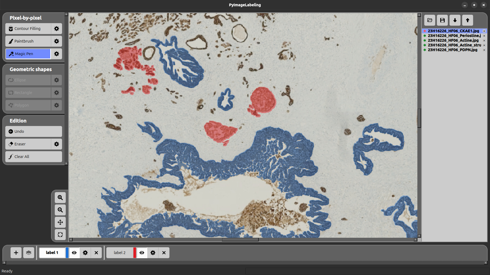

# PyImageLabeling

[](https://pypi.org/project/PyImageLabeling/)
[](https://www.python.org/downloads/)
[](https://github.com/crillab/PyImageLabeling/tree/master?tab=MIT-1-ov-file#)


## Links

- **GitHub Repository**: [View codesource](https://github.com/crillab/PyImageLabeling).
- **PyPI**: [Install via pip](https://pypi.org/project/PyImageLabeling/).

A powerful tool with a **user-friendly interface** based on PyQT6 for creating image masks. These **labeled images** are used in the creation of **machine learning models** dedicated to **computer vision tasks**. 

Two types of labeling are available: 
- **Pixel-by-Pixel**: allows to use the pixel-level precision (paintbrush, magic pen, contour filling).
- **Geometric shapes**: allows to use different geometric shapes (polygon, rectangle, ellipse) for labeling.


*Main interface showing the comprehensive toolset for image annotation*

### Installation and Run

Note that you need first Python 3 (version 3.12, or later) to be installed. You can do it, for example, from [Python.org](www.python.org).

## PyPi installation (Windows, Mac and Linux)

Check whether you have the last version of PyPi:

```bash
python3 -m pip install -U pip
```

Install PyImageLabeling: 

```bash
python3 -m pip install -U PyImageLabeling
```

To launch PyImageLabeling:

```bash
python3 -m PyImageLabeling
```

## Executable ".exe" (Windows)

You can download the [Windows executable](https://github.com/crillab/PyImageLabeling/releases/tag/exec). 
Just double-click on the executable file to launch PyImageLabeling.   


## Github Installation (Windows, Mac and Linux)

Here is an illustration for Linux. We assume that Python 3 is installed, and consequently ‘pip3’ is also installed. In a console, type:

```bash
git clone https://github.com/crillab/PyImageLabeling.git
```

You may need to update the environment variable ‘PYTHONPATH’, by typing for example:
```bash
export PYTHONPATH="${PYTHONPATH}:${PWD}/.."
```

Get the last version of pip:
```bash
python3 -m pip install --upgrade pip
```

Executes the pyproject.toml inside the PyImageLabeling directory and installs dependencies ("numpy", "pyqt6", "opencv-python", "pillow", "matplotlib").
```bash
python3 -m pip install -e .
```

To launch PyImageLabeling:

```bash
python3 -m PyImageLabeling
```

## Features

PyImageLabeling considers that you have two working directories (which may be the same): 
- The **working directory** containing your images to be labeled. 
- The **saving directory** containing your labeled images and a JSON file.

The **saving directory** consists of:   
- The **labeled PNG files**: each label of each image is represented by a labeled PNG file.
- The **JSON file** contains several information about labels: identifier, name, color and type.

### **Load/Save and Image Management**

| **Tool**          | **Functionality**                                                                                      |
|-------------------|--------------------------------------------------------------------------------------------------------|
| **Load**          | Load images and/or labeled images from a **working or saving directory**                               |
| **Save**          | Save current labeled images in a **saving directory**                                                  |
| **Next**          | Select the next image                                                                                  |
| **Previous**      | Select the previous image                                                                              |

### Navigation & Controls

| **Movement**      | **Function**                                                                                           |
|-------------------|--------------------------------------------------------------------------------------------------------|
| **Zoom in**       | Click to zoom in (up mouse wheel shorcut)                                                              |
| **Zoom out**      | Click to zoom out (down mouse wheel shorcut)                                                           |
| **Move**          | Click and drag to move the current (wheel mouse click shorcut)                                         |
| **Reset**         | Reset to default view (zoom and position)                                                              |


## Toolset

### **Image Management**
| **Tool**          | **Functionality**                                                                                      |
|-------------------|--------------------------------------------------------------------------------------------------------|
| **Load Image**    | Import images and label's layers from your local system with support for multiple formats              |
| **Save**          | Export current annotations with automatic directory creation                                           |
| **Next**          | Load next image                                                                                        |
| **Previous**      | Load previous image                                                                                    |

### **Navigation Tools**
| **Tool**          | **Functionality**                                                                                      |
|-------------------|--------------------------------------------------------------------------------------------------------|


### **Visual Controls**
| **Tool**          | **Functionality**                                                                                      |
|-------------------|--------------------------------------------------------------------------------------------------------|
| **Plus**          | Add a new label                                                                                        |
| **Opacity**       | Fine-tune layer transparency for precise overlay work                                                  |

### **Label's Tools**
| **Tool**          | **Functionality**                                                                                      |
|-------------------|--------------------------------------------------------------------------------------------------------|
| **Color**         | Set the color of the selected label                                                                    |
| **Visibility**    | Set the visibilty of the selected label                                                                |
| **Setting**       | Set the parameters of the selected label                                                               |
| **Remove**        | Remove the selected label                                                                              |


### **Annotation Tools**
| **Tool**             | **Pixel-by-pixel**                                                                                  |
|----------------------|-----------------------------------------------------------------------------------------------------|
| **Contour Filling**  | Shape detection and extraction - click to fill detected shape                                       |
| **Paintbrush**       | Paint brush tool to mark desired area                                                               |
| **Magic Pen**        | Intelligent fill tool based on color similarity and tolerance                                       |


**IS COMING**

| **Tool**             | **Geometric shapes**                                                                                |
|----------------------|-----------------------------------------------------------------------------------------------------|
| **Ellipse**          | Precision ellipse selection for label assignment                                                    |
| **Rectangle**        | Precision rectangular selection for label assignment                                                |
| **Polygon**          | Precision polygon selection for label assignment                                                    |

### **Editing Tools**
Each editing tools is proper to each selected label.
| **Tool**          | **Functionality**                                                                                      |
|-------------------|--------------------------------------------------------------------------------------------------------|
| **Undo**          | Revert the last action with full history support                                                       |
| **Eraser**        | Remove annotations with size control and "Absolute" mode for loaded layer editing                      |
| **Clear All**     | Reset canvas by removing all current annotations                                                       |

## License

This project is licensed under the MIT License - see the [LICENSE](https://github.com/crillab/PyImageLabeling/tree/master?tab=MIT-1-ov-file#) file for details.

## Use Cases

- **Computer Vision**: Create training datasets for object detection and segmentation
- **Medical Imaging**: Annotate medical scans and diagnostic images
- **Autonomous Vehicles**: Label road scenes and traffic elements
- **Agriculture**: Mark crop areas and plant health indicators
- **Quality Control**: Identify defects and areas of interest in industrial applications

---
