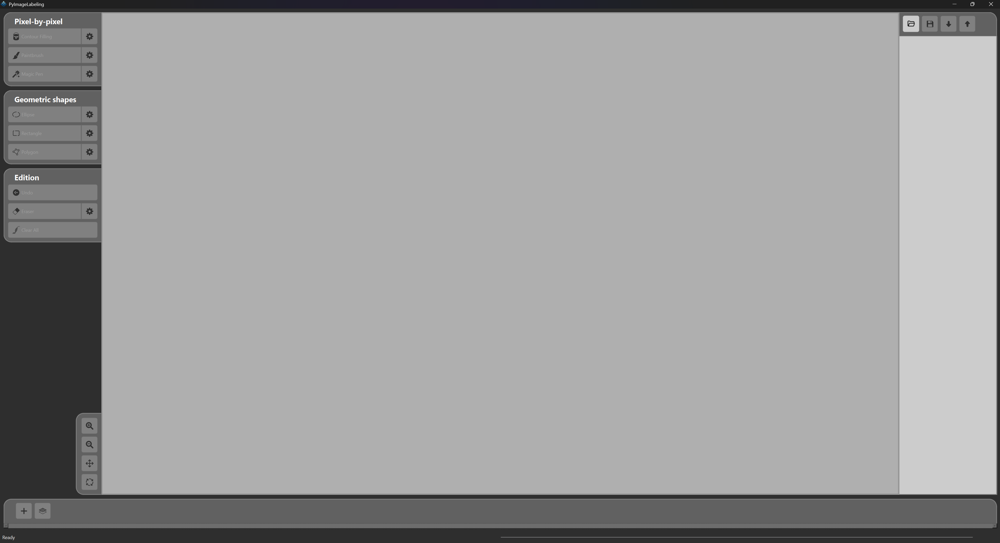
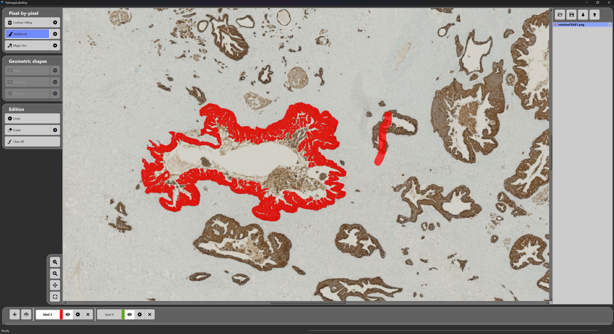

# PyImageLabeling

[](https://badge.fury.io/py/pyimagelabeling)
[](https://www.python.org/downloads/)
[](https://opensource.org/licenses/MIT)


## Links

- **GitHub Repository**: [View codesource](https://github.com/crillab/PyImageLabeling).
- **PyPI**: [Install via pip](https://pypi.org/project/PyImageLabeling/).


> **A powerful and intuitive tool for creating image masks and annotations for Machine Learning model training**

PyImageLabeling is designed to the creation of masks for labelisation which could be used to train Machine Learning models. With its comprehensive set of annotation tools and user-friendly interface, you can efficiently label and annotate images for computer vision tasks.


### Installation and Run

```bash
# Install from PyPI
pip install PyImageLabeling
python3 -m PyImageLabeling
```


*Main interface showing the comprehensive toolset for image annotation*

## Principle

Load a study image and use a variety of professional-grade tools to annotate key data points. Once your work is saved, a save directory will be automatically created in your working folder, containing the mask in PNG format along with metadata for your annotations.

## Navigation & Controls

| **Movement**      | **Function**                                     |
|-------------------|--------------------------------------------------|
| Mouse wheel       | Zoom in/out                                      |
| Left-click + drag | Move the image (when "Move" tool is active)     |

## Toolset

### **Image Management**
| **Tool**          | **Functionality**                                                                                      |
|-------------------|--------------------------------------------------------------------------------------------------------|
| **Load Image**    | Import images and label's layers from your local system with support for multiple formats              |
| **Save**          | Export current annotations with automatic directory creation                                           |
| **Next**          | Load next image                                                                                        |
| **Previous**      | Load previous image                                                                                    |

### **Navigation Tools**
| **Tool**          | **Functionality**                                                                                      |
|-------------------|--------------------------------------------------------------------------------------------------------|
| **Zoom in**       | click to zoom in                                                                                       |
| **Zoom out**      | click to zoom out                                                                                      |
| **Move**          | Activate pan mode for image navigation (enabled by default)                                            |
| **Reset**         | Reset zoom and pan to default view                                                                     |


### **Visual Controls**
| **Tool**          | **Functionality**                                                                                      |
|-------------------|--------------------------------------------------------------------------------------------------------|
| **Opacity**       | Fine-tune layer transparency for precise overlay work                                                  |

### **Annotation Tools**
| **Tool**             | **Pixel-by-pixel**                                                                                  |
|----------------------|-----------------------------------------------------------------------------------------------------|
| **Contour Filling**  |Shape detection and extraction - click to fill detected shape                                        |
| **Paintbrush**       | Paint brush tool to mark desired area                                                               |
| **Magic Pen**        | Intelligent fill tool based on color similarity and tolerance                                       |



**IS COMING**

| **Tool**             | **Geometric shapes**                                                                                |
|----------------------|-----------------------------------------------------------------------------------------------------|
| **Ellipse**          | Precision ellipse selection for label assignment                                                    |
| **Rectangle**        | Precision rectangular selection for label assignment                                                |
| **Polygon**          | Precision polygon selection for label assignment                                                    |

### **Editing Tools**
Each editing tools is proper to each selected label.
| **Tool**          | **Functionality**                                                                                      |
|-------------------|--------------------------------------------------------------------------------------------------------|
| **Undo**          | Revert the last action with full history support                                                       |
| **Eraser**        | Remove annotations with size control and "Absolute" mode for loaded layer editing                      |
| **Clear All**     | Reset canvas by removing all current annotations                                                       |

## License

This project is licensed under the MIT License - see the [LICENSE](LICENSE) file for details.

## Use Cases

- **Computer Vision**: Create training datasets for object detection and segmentation
- **Medical Imaging**: Annotate medical scans and diagnostic images
- **Autonomous Vehicles**: Label road scenes and traffic elements
- **Agriculture**: Mark crop areas and plant health indicators
- **Quality Control**: Identify defects and areas of interest in industrial applications

---
